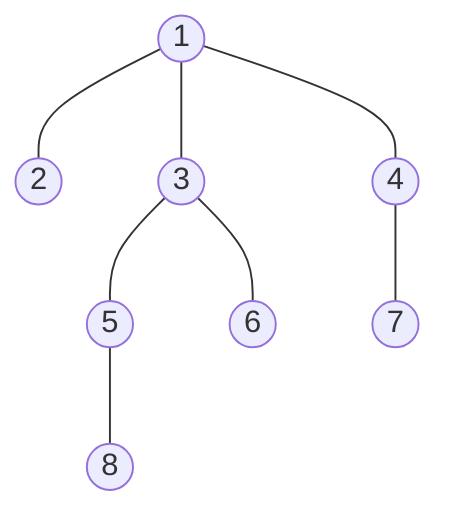

# BFS Algorithm

 

## 너비 우선 탐색(BFS)이란?

-   그래프 혹은 트리에서 _모든 노드를 한 번씩 탐색하기 위한 기본적인 방법_ 이다.
-   `완전 탐색`을 수행하기 위해 사용할 수 있는 방법 중 하나
-   (모든 간선의 길이가 동일할 때) 최단 거리를 탐색하기 위한 목적으로 사용할 수 있다.
-   `큐(Queue) 자료구조`를 사용한다.
    -   기본적으로 DFS는 스택, BFS는 큐를 사용한다.

 
 

## 너비 우선 탐색(BFS) 기본 동작 방식

-   BFS는 다음과 같은 방법으로 동작한다.

1. **시작 노드**를 큐에 넣고 **[방문 처리]** 한다.
2. 큐에서 원소를 꺼내어 *방문하지 않은 인접 노드*가 있는지 확인한다.
    - 있다면, 방문하지 않은 인접 노드를 큐에 **삽입**하고 **[방문 처리]** 한다.
3. 2번의 과정을 더 이상 반복할 수 없을 때까지 반복한다.

