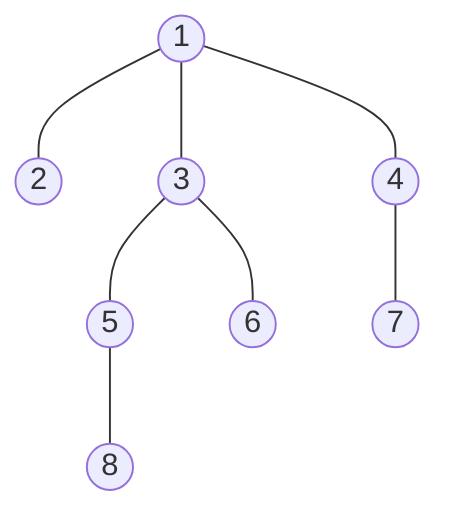

# DFS Algorithm

 

## 깊이 우선 탐색(DFS)이란?

-   그래프 혹은 트리에서 **_모든 노드를 한 번씩 탐색하기 위한 기본적인 방법_** 이다.
-   `완전 탐색`을 수행하기 위해 사용할 수 있는 가장 간단한 방법 중 하나.
-   `스택(stack) 자료구조`를 사용한다.

 
 

## 깊이 우선 탐색(DFS) 기본 동작 방식

-   DFS는 다음과 같은 방법으로 동작한다.

1. **시작 노드**를 스택에 넣고 **[방문 처리]** 한다.
2. 스택에 마지막으로 들어온 노드에 *방문하지 않은 인접 노드*가 있는지 확인한다.
    - 있다면, 방문하지 않은 인접 노드를 스택에 **삽입**하고 **[방문 처리]** 한다.
    - 없다면, 현재 노드(스택에 마지막으로 들어 온 노드)를 스택에서 **추출**한다.
3. 2번 과정을 더 이상 반복할 수 없을 때까지 반복한다.

 
 

## 깊이 우선 탐색(DFS) 구현 특징

-   DFS를 실제로 구현할 때는 **스택 혹은 재귀 함수**를 이용한다.
    -   재귀 함수는 내부적으로 스택과 동일한 동작 원리를 가지므로, 구현의 편리성이 존재한다.
-   완전 탐색을 목적으로 하는 경우, 탐색 속도가 BFS보다 느린 경향이 있다.
-   그럼에도 구현의 편리성 때문에 BFS 대신에 사용하는 경우 또한 많다.

 

### 깊이 우선 탐색(DFS) 사용 예시

1. 더 짧은 코드로 간결히 구현해야 하는 경우
2. 큐 라이브러리를 사용할 수 없는 경우
3. 트리의 순회, 점화식 구현 등 DFS(재귀 구조)에 특화된 문제인 경우
4. 트리에서 최단 거리 탐색을 구하는 경우
    - 트리에서는 두 노드를 잇는 경로가 하나만 존재한다.

 
 

## DFS 기본 동작 방식

-   도달 가능한 **[모든 위치]** 를 탐색하는 경우를 고려해 보자.
-   **DFS** : 도달 가능한 끝 위치까지 도달했다면, 다시 최근의 **[갈림길]** 로 돌아가서, 다른 위치로도 가보는 방식과 유사하다.

### 노드 방문 순서 : 1 -> 2 -> 3 -> 5 -> 8 -> 6 -> 4 -> 7

 

## DFS를 활용한 완전 탐색

-   흔히 DFS는 모든 노드를 `완전 탐색` 하기 위한 방법으로 사용된다.
-   완전 탐색 알고리즘에서는 기본적으로 각 노드 및 간선에 대하여 `한번씩 확인`하도록 한다.
-   DFS를 응용하여 *모든 경우의 수*를 계산하기 위한 백트래킹(back-tracking) 알고리즘으로 사용할 수 있다. (기본 알고리즘)
    -   백트래킹에 비하여 기본적인 형태의 DFS는 그 코드 예시가 간단하다.
