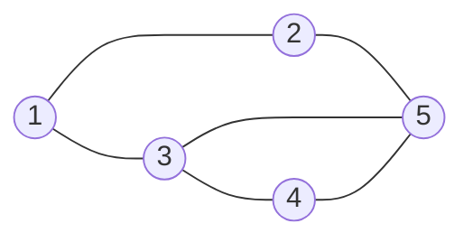

# DFS 와 BFS

-   탐색(Search)이란 많은 양의 데이터 중에서 **원하는 데이터를 찾는 과정**을 의미한다.
-   대표적인 그래프 탐색 알고리즘으로는 DFS와 BFS가 있다.
-   `DFS와 DFS는 코딩 테스트에서 매우 자주 등장하는 유형`이므로 반드시 숙지할 필요가 있다.

 

## 그래프의 표현

-   일반적으로 JavaScript로 DFS / BFS 와 같은 그래프 문제를 해결할 때는?
-   2차원 배열(리스트)로 그래프를 표현한다.
-   인접 리스트 표현 방식의 예시는 다음과 같다.

### 인접 리스트

-   1 : 2,3
-   2 : 1,5
-   3 : 1,4,5
-   4 : 3,5
-   5 : 2,3,4
